 

  

  

 

---

<table>
  <tr>
    <td align="left">🚀</td>
    <td><b>Ships features before the meeting ends</b></td>
  </tr>
  <tr>
    <td align="left">🧩</td>
    <td>Thinks in components, dreams in APIs</td>
  </tr>
  <tr>
    <td align="left">🔍</td>
    <td>Bugs don't hide — they just wait to be found</td>
  </tr>
  <tr>
    <td align="left">✨</td>
    <td>Clean code, or it gets rewritten</td>
  </tr>
  <tr>
    <td align="left">🤖</td>
    <td>Watching AI closely before it watches me</td>
  </tr>
</table>

---

## 🛠️ Tech Stack

<table>
  <thead>
    <tr>
      <th>🌐 Languages</th>
      <th>🎨 Frontend</th>
      <th>⚙️ Backend</th>
      <th>🗄️ Databases</th>
      <th>🛠️ Tools & DevOps</th>
    </tr>
  </thead>
  <tbody>
    <tr>
      <td align="center">
         
         
        
      </td>
      <td align="center">
         
         
         
         
        
      </td>
      <td align="center">
         
         
        
      </td>
      <td align="center">
         
         
         
        
      </td>
      <td align="center">
         
         
         
         
        
      </td>
    </tr>
  </tbody>
</table>

---

## 📊 Stats

 

---

## 🏆 Trophies

---

## 📈 Activity

---

## 🐍 Contributions

---

## 🔗 Connect

 

 

  

